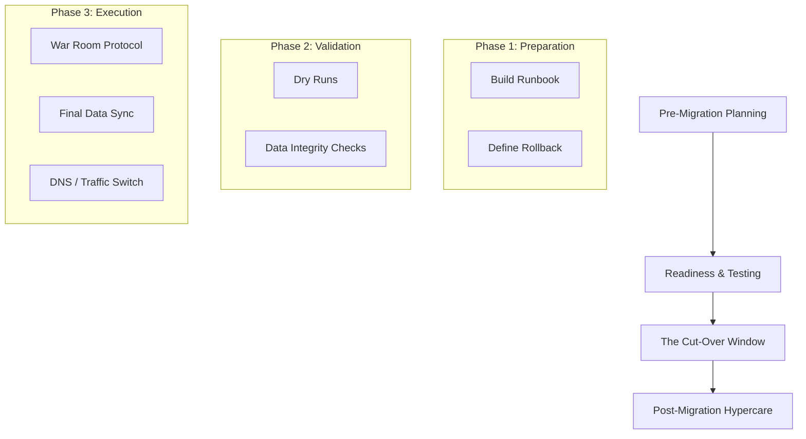

# Migration & Cut-Over Execution Guide

Modernizing your technology stack is a strategic investment. This guide explains **why** migrations are necessary and breaks down the essential tasks required for a seamless transition.

---

## 0. Strategic Drivers: Why Migrate?

Migrations are high-stakes operations, but they are often necessary for several critical reasons:

| Driver | Description |
| :--- | :--- |
| **Scalability** | Your current infrastructure has reached its limit and cannot handle projected growth or high-traffic events. |
| **Performance** | Legacy stacks often suffer from slow "First Contentful Paint" (FCP) and poor UX compared to modern Vite/React environments. |
| **Cost Efficiency** | Modern cloud-native architectures (Serverless/Edge) often reduce operational overhead and licensing costs compared to on-premise or managed VMs. |
| **Security & Compliance** | Older systems may have unpatchable vulnerabilities or fail to meet modern data privacy standards (GDPR, SOC2). |
| **Developer Velocity** | Your team is slowed down by "Technical Debt." Migrating to modern tooling allows for faster feature delivery and easier maintenance. |

---

## 1. Core Concepts

| Term | Definition |
| :--- | :--- |
| **Migration** | The process of moving data, applications, or infrastructure from one environment to another. |
| **Cut-Over** | The final "Go-Live" event where the old system is retired and traffic is redirected to the new system. |
| **Runbook** | A minute-by-minute script of every action, owner, and dependency during the cut-over. |
| **Hypercare** | An intensive period of post-migration support to ensure stability. |

---

## 2. Migration Execution Lifecycle

---

## 3. Detailed Execution Task List

### Phase 1: Pre-Migration & Planning
> [!IMPORTANT]
> The "Runbook" is your single source of truth. If it isn't in the runbook, it doesn't happen.

*   **Finalize the Runbook:** Document every step (e.g., "Step 12: Run SQL script `v2_migrate.sql`").
*   **Establish "Freeze" Windows:** Implement a code and data freeze 24-48 hours before the cut-over.
*   **Rollback Strategy:** Document the exact "Point of No Return" and the procedure to revert if things fail.
*   **Infrastructure Provisioning:** Ensure the target environment is scaled and identical to production specifications.

### Phase 2: Readiness & Testing
*   **Dry Run Execution:** Perform at least two simulation migrations in a staging environment.
*   **Performance Benchmarking:** Validate that the new system handles expected loads.
*   **Security Audit:** Ensure IAM roles, firewalls, and SSL certificates are correctly configured.
*   **Go/No-Go Meeting:** A formal sign-off from all stakeholders (Tech, Business, QA).

### Phase 3: The Cut-Over (Go-Live)
*   **The "War Room":** Activate a dedicated communication channel (Slack/Zoom) for real-time status updates.
*   **Maintenance Page Activation:** Redirect users to a "Coming Back Soon" page to prevent data corruption.
*   **Final Data Delta Sync:** Copy the final remaining data that changed since the last backup.
*   **DNS Switch / Traffic Redirection:** Update CNAME/A records or Load Balancer weights to point to the new stack.
*   **Smoke Testing:** A quick validation of critical paths (Login, Checkout, App Dashboard).

### Phase 4: Post-Migration & Hypercare
> [!TIP]
> Keep the legacy system in a "Read-Only" state for at least 72 hours—never delete it immediately!

*   **Real-time Monitoring:** Watch error logs (Sentry/CloudWatch) and performance metrics.
*   **Stakeholder Communication:** Send "Go-Live Successful" emails to the broader organization.
*   **The Decommissioning Phase:** Archive legacy data and safely power down old infrastructure after the stabilization period.

---

## 4. Common Pitfalls to Avoid

1.  **Skipping the Dry Run:** "It works on my machine" is the fastest way to a failed cut-over.
2.  **No Rollback Plan:** Never assume perfection. Know how to go back.
3.  **Poor Communication:** Not telling users about the maintenance window leads to support tickets and frustration.
4.  **DNS TTL Issues:** Forgetting to lower DNS Time-To-Live (TTL) values 24 hours in advance, causing some users to see the old site for hours.

---

## 5. Sample Cut-Over Checklist

| Task ID | Action | Owner | Duration | Status |
| :--- | :--- | :--- | :--- | :--- |
| C01 | Initiate Maintenance Mode | DevOps | 5m | [ ] |
| C02 | Stop Legacy Database | DBA | 10m | [ ] |
| C03 | Final DB Sync to Target | DBA | 30m | [ ] |
| C04 | Update API Endpoints | Backend | 15m | [ ] |
| C05 | Switch Production Traffic | SRE | 5m | [ ] |
| C06 | Initial Smoke Test | QA | 20m | [ ] |
